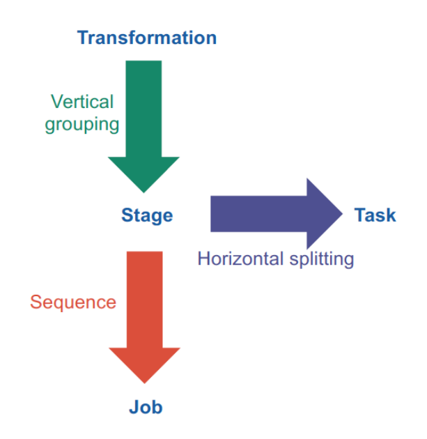

# Spark

## RDD

**R**esilient **D**istributed **D**ataset.

* **Resilient**: remain in <u>memory</u> or on disk on a "best effort" basis, can be recomputed if needs be
* **Distributed**

RDDs <u>need not be</u> collection of key-value pairs, it can be (ordered) collection of *anything*. But we do have one constraint: <u>the values within the same RDD share the same static type</u>.

## RDD Lifecycle!!!

1. Creation
2. Transformation: transform one RDD into another RDD!
3. **Action**
   1. A final action that make an output <u>persistent</u>!
4. **Lazy** evaluation
   1. <u>Creation and transformations on their own do NOTHING</u>
   2. Only with an <u>action</u> that the entire computation pipeline is put into motion

## Types of transformations

### Unary

* `filter`
  * input: a predicate function: take a value, return a `Boolean`
  * return: subset of input satisfying the predicate
  * <u>preserve relative order</u>
* `map`
  * input: a function: take a value, return another value (**one to one!!!**)
  * return: the list of values obtained by applying this function to <u>each value in the input</u>
* `flatMap`:
  * input: a function: take a value, return **0, 1, or more** values
  * return: the list of values obtained by applying this function to <u>each value in the input</u>, **flattening the obtained values** (information on which values came from the same input value is <u>lost</u>)
  * **`flatMap` IS THE SAME AS MapReduce's map, not `map`!!!**
* `distinct`
  * input: comparator function (or none if the values are comparable)
  * return: the list of values obtained by removing duplicates from the input
* `sample`
  * input: none additional (just the input RDD)
  * return: a subset of the input RDD (smaller than the input RDD)

### Binary

* `union`
* `intersection`
* `subtract`: remove all elements from the first RDD (left) that are also in the second RDD (right)

### Pair transformations

Spark has transformations specifically tailored for RDDs of key-value pairs!

* `key`
  * return only the keys of the input RDD
* `values`
  * return only the values of the input RDD
* `reduceByKeys`
  * input: a (normally associative and commutative) binary operator
  * return: a new RDD with the same keys as the input RDD, but with the values reduced by the binary operator (invokes and chians this operator on all values of the input RDD that share the same key)
    * (k, (v1 + v2 + ... + vn)) is output assuming + is the operator.
  * **`reduceByKey` IS THE SAME AS MapReduce's reduce!!!**
* `groupByKey`
  * groups all kv pairs by key, and returns a single kv for each key where value is an array
* `sortByKey`
* `mapValues`
  * Similar to the `map` transformation (not `flatMap`!), but map function only applied to the value and the key is kept
* `join`
  * works on two input RDDs <u>or</u> key-value pairs
  * matches the pairs on both sides that have the same **key**
  * outputs, for **each** match, **an output pair** with that shared key and a **tuple** with the **two values** from each side.
  * If there are multiple values with the same key on any side (or both), then all possible combinations are output.
* `subtractByKey`

## Types of actions!

### Gather output locally

By locally we mean in the client machine memory!

* `collect`
  * downloads all values of an RDD on the client machine and output as a local list
  * **only use if the output is small enough to fit in memory**
* `count`
  * computes (in parallel) the total number of values (count duplicates!) in the input RDD
  * *safe for large RDDs bcuz only returns a smol integer*
* `countByValue`
  * computes (in parallel) the number of times each <u>distinct</u> value appears in the input RDD
  * **only use if the output is small enough to fit in memory**
* `take`
  * returns the **first** `n` values of the input RDD
* `top`
  * returns the **last** `n` values of the input RDD
* `takeSample`
  * returns a random sample of `n` values from the input RDD
* `reduce`
  * input: a (normally associative and commutative) binary operator
  * return: a new RDD with the operator invoked and chained on all values of the input RDD
    * (v1 + v2 + ... + vn if + is the operator) and outputs the resulting value.
  * no key!
  * output is a single value?

### Write output

* `saveAsTextFile`
* `saveAsObjectFile`

### Actions for Pair RDDs

* `countByKey`
  * outputs locally each key together with the number of values in the input taht are associated with this key
  * a local list of key-value pairs
  * **only use if the the input RDD does not have lots of distinct keys**
* `lookup`
  * get the value or values associated with a given key

## Physical Architecture

* narrow-dependency: computation involves <u>only a single input</u>
* wide-dependency: computation involves multiple inputs

**Stage**: chain of narrow dependency transformations (`map`, `filter`, `flatMap`) etc (== phase in MapReduce)

