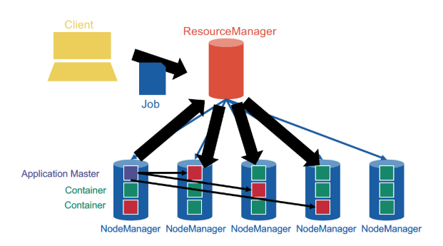

# YARN

## MapReduce architecture version 1 (no YARN)

Per cluster 1 `JobTracker` (typically run together on `NameNode` and `HMaster` )+ multiple `TaskTracker`s (typically run together on `DataNode` and `RegionServer`).

Intermediate pairs are sorted by key and flushed to disk to a Sequence File (will be merged according to log-structured merge trees).

When the map phase is over, each TaskTracker runs an HTTP server
listening for connections, so that they can connect to each other and ship the intermediate data over to create the intermediate partitions ensuring that *the same keys are on the same machines*

shuffling can start before the map phase is over, but the
reduce phase can only start after the map phase is over

reduce phase outputs **shard**s (file names are `part-00000`, `part-00001`, etc) to the distributed file system (HDFS, S3 etc)

In the very first version of MapReduce (with a JobTracker and
TaskTrackers), map slots and reduce slots are all **pre-allocated** from the very beginning, which blocks parts of the cluster remaining idle in both phases.

## YARN general architecture

not `JobTracker` and `TaskTracker` anymore, but `ResourceManager` and `NodeManager`. `NodeManager`s provide "slots" as containers for tasks.

YARN provides generic support for allocating resources to any application and is application-agnostic. When a new application is launched, the **ResourceManager assigns one of the container to act as the ApplicationMaster** which will take care of running the application. This is a fundamental change from the initial MapReduce architecture, in which the JobTracker was *also* taking care of running the MapReduce job. The ApplicationMaster can then communicate with the ResourceManager in order to book and use more containers in order to run jobs.

YARN cleanly separates between the general management of
resources and bootstrapping new applications, which remains centralized on the coordinator node, and monitoring the job lifecycle, which
is now delegated to one or more ApplicationMasters running concurrently. This means, in particular, that several applications can run concurrently in the same cluster. This ability, known as multi-tenancy, is very important for large companies or universities in order to optimize the use of their resources.

## Resource management

By issuing tokens.

Bootstrap a new application: `ResourceManager` issues **application tokens** to clients and start the `ApplicationMaster`.

General resource request:

1. `ApplicationMaster` request container with spec from `ResourceManager` (e.g. 10core 10GB RAM)
2. `ResourceManager` allocates  issues **container tokens** to `ApplicationMaster`
3. `ApplicationMaster` connects to the allocated `NodeManager` and sends the container token
4. `NodeManager` checks the container token and starts the container
5. `ApplicationMaster` ships the code and parameters to the container

## Scheduling!

The ResourceManager decides whether and when to grant resource requests based on several factors: capacity guarantees, fairness, service level agreements (remember the numbers with plenty of 9s?) and with the **goal** to **maximize cluster utilization**

The ResourceManager keeps track of the list of available NodeManagers (who can dynamically come and go) and their status. Just like in HDFS, NodeManagers send periodic heartbeats to the ResourceManager to give a sign of life.

### Strategies

* FIFO
* Capacity
  * different sizes of subclusters
  * can have hierarchical subclusters (hierarchical queues)
  * can lend resources to other subclusters if not used
* Fair scheduling -- compute cluster shares dynamically
  * Steady fair share
    * share of the cluster officially allocated to each user
    * user agree on the share in advance
    * static, rarely change
  * Instantaneous fair share
    * the fair share that a department should ideally be allocated
    * changes constantly
    * if user is idle, then the instantaneous fair share of other user becomes larger
  * Current share
    * Actual share of the cluster
    * highly dynamic
    * does not necessarily match the instantaneous fair share

easiest fair scheduling: the requests by users who are significantly below their instantaneous fair share are prioritized

Multidimensional resource scheduling: **Dominant Resource Fairness algorithm**

e.g. 1000 cores and 10TB mem cluster, A requests containers with 1 core and 100GB RAM, B requests containers with 4 cores and 10GB RAM

* A: 0.1% core, 1% mem -- dominant resource is mem
* B: 0.4% core, 0.1% mem -- dominant resource is core

Say they both have instantaneous fair share of 50%, then every time A gets 2 containers, B gets 5 containers.
