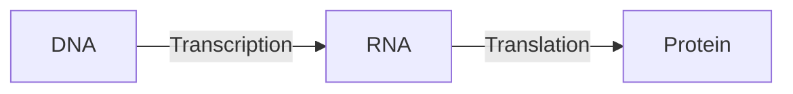
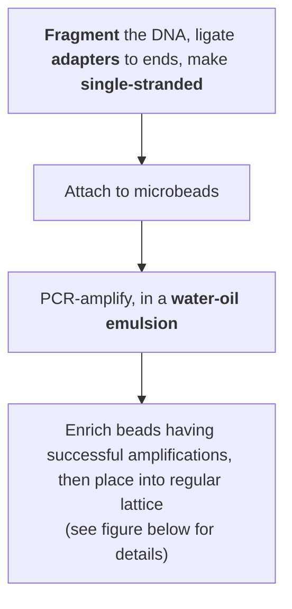

# Modern Genomics I

<!-- toc -->

## Introduction

Molecular biology is governed by the "central dogma". Genomics is basically studying the <em>DNA</em> part of it.

**Genome sequence**: complete listing of <u>all nucleotides</u> of <u>one organisms</u>, in correct order, and mapped to the chromosomes.

### Timeline

Efficient sequencing technology arrived rather late. Initially the sequencing process was cumbersome and radioactive.

- 1975: "dideoxy" DNA sequencing (Sanger)
- 1977: first genome (<u>bacteriophage $\phi X 174$</u>)
- 1995: first <u>cell</u> (Haemophilus influenzae)
- 1998: first animal (Caenorhabditis elegans)
- 2001: Homo sapiens
- Today (February 2023)
  - genomes available for: 409,947 Bacteria, 4,988 Archaea, 47,200 Eukaryotes
  - human genomes fairly routine
    - below 1000$ raw costs
    - "Personal Genome Projects" are enrolling 100’000s of volunteers, including their medical records

### Why Genomics?

- Because we want an inventory of all genes and functions
- Because wea can compare genomes to learn about evolution, to get hints on gene function, etc
  - Comparison can be either based on DNA or protein
  - Alignments, dot plots, whole chromosome comparison

### Comparative genomics use case examples

- Gene prediction
  - Gene prediction algorithms that use homology (=comparative genomics result) information: SLAM, SGP, Twinscan (= N-SCAN)...
  - 
- Gene family evolution

## Classical sequencing method

### Sanger (double-deoxy) sequencing

Natural DNA extension requires 3'-OH. The dideoxy method uses a 2',3'-dideoxy nucleotide, which lacks the 3'-OH group. This causes the DNA chain to terminate. By introducing different dideoxy nucleotides, the sequence can be read.

### Automated Dye Sequencing

Variants of Sanger sequencing. Still utilize the dideoxy method to terminate DNA elongation. The difference is that the dideoxy nucleotides are labeled with different fluorescent dyes. The sequence is read by a laser.

Dye terminator sequencing is now widely used over the rather cumbersome (4 tubes per sample) dye primer chemistry.

## New (Next-generation) sequencing technologies

Generally involves first amplifying the DNA, then sequencing it. Sequencing is done by detecting the nucleotides as they are incorporated into the growing DNA strand (sequencing by synthesis). High-throughput is achieved by parallelizing the sequencing process.

### Amplification technologies

first-generation amplification technology: needs DNA-library in bacterial vectors --> cumbersome and biased

#### Emulsion PCR

Improvement: bacterium free, but still needs cloning

In short, the enrichment is done by capturing the second (5'-end) primer of the PCR product onto a large polysyrene bead.

#### PCR on solid support

### Barcoding and "linked reads"

### Sequencing technologies

first-generation sequencing needs DNA size-separation on a gel

#### Pyrosequencing

#### Reversible terminator sequencing

#### Sequencing by semi-conductor

Directly detects the release of H+ ions when a nucleotide is incorporated into the growing DNA strand.

### Current implementations of NGS

- Illumina
  - Illumina NovaSeq 6000
  - PCR on <u>solid support</u>
  - <u>reversible terminator</u> sequencing
  - read length ca. 250bp
  - `1e14` bp per run
- Ion Torrent / Life Techn. Inc
  - Ion Gene Studio S5
  - PCR on <u>beads</u>
  - sequencing by <u>semi-conductor</u>
  - read length ca. 600bp
  - `1e10` bp per run

## Third-generation sequencing technologies

Single molecule sequencing. No need for amplification.

Characterized by extremely long reads, but also high error rates.

- Pacific Biosciences
  - SMRT (single molecule real time) sequencing
  - 
  - 
- Oxford Nanopore
  - MinION
  - 
