# Modern Genomics I

<!-- toc -->

## Introduction

Molecular biology is governed by the "central dogma". Genomics is basically studying the <em>DNA</em> part of it.

**Genome sequence**: complete listing of <u>all nucleotides</u> of <u>one organisms</u>, in correct order, and mapped to the chromosomes.

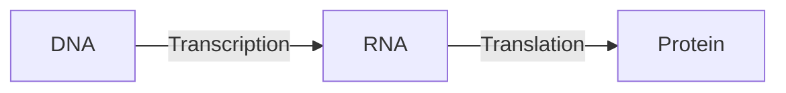

### Timeline

Efficient sequencing technology arrived rather late. Initially the sequencing process was cumbersome and radioactive.

- 1975: "dideoxy" DNA sequencing (Sanger)
- 1977: first genome (<u>bacteriophage $\phi X 174$</u>)
- 1995: first <u>cell</u> (Haemophilus influenzae)
- 1998: first animal (Caenorhabditis elegans)
- 2001: Homo sapiens
- Today (February 2023)
  - genomes available for: 409,947 Bacteria, 4,988 Archaea, 47,200 Eukaryotes
  - human genomes fairly routine
    - below 1000$ raw costs
    - "Personal Genome Projects" are enrolling 100’000s of volunteers, including their medical records

### Why Genomics?

- Because we want an inventory of all genes and functions
- Because wea can compare genomes to learn about evolution, to get hints on gene function, etc
  - Comparison can be either based on DNA or protein
  - Alignments, dot plots, whole chromosome comparison

### Comparative genomics use case examples

- Gene prediction
  - Gene prediction algorithms that use homology (=comparative genomics result) information: SLAM, SGP, Twinscan (= N-SCAN)...
  - 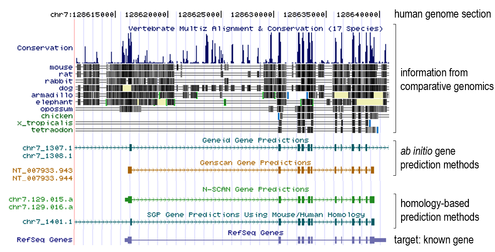
- Gene family evolution

## Classical sequencing method

### Sanger (double-deoxy) sequencing

Natural DNA extension requires 3'-OH. The dideoxy method uses a 2',3'-dideoxy nucleotide, which lacks the 3'-OH group. This causes the DNA chain to terminate. By introducing different dideoxy nucleotides, the sequence can be read.

### Automated Dye Sequencing

Variants of Sanger sequencing. Still utilize the dideoxy method to terminate DNA elongation. The difference is that the dideoxy nucleotides are labeled with different fluorescent dyes. The sequence is read by a laser.

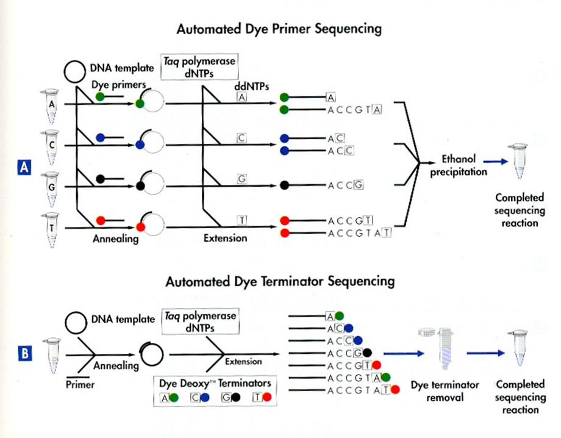

Dye terminator sequencing is now widely used over the rather cumbersome (4 tubes per sample) dye primer chemistry.

## New (Next-generation) sequencing technologies

Generally involves first **amplifying** the DNA, then **sequencing** it. Sequencing is done by detecting the nucleotides as they are incorporated into the growing DNA strand (sequencing by synthesis). High-throughput is achieved by parallelizing the sequencing process.

### Amplification technologies

First-generation amplification technology: needs DNA-library in bacterial vectors --> cumbersome and biased

Improvement: get rid of bacteria

#### Emulsion PCR

Improvement: bacterium free, but still needs cloning

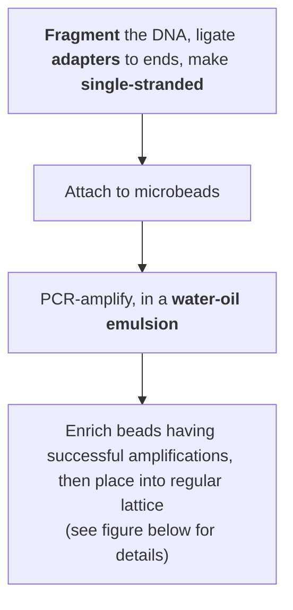

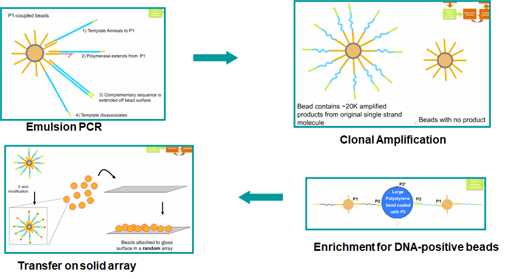

In short, the enrichment is done by capturing the second (5'-end) primer of the PCR product onto a large polysyrene bead.

#### PCR on solid support

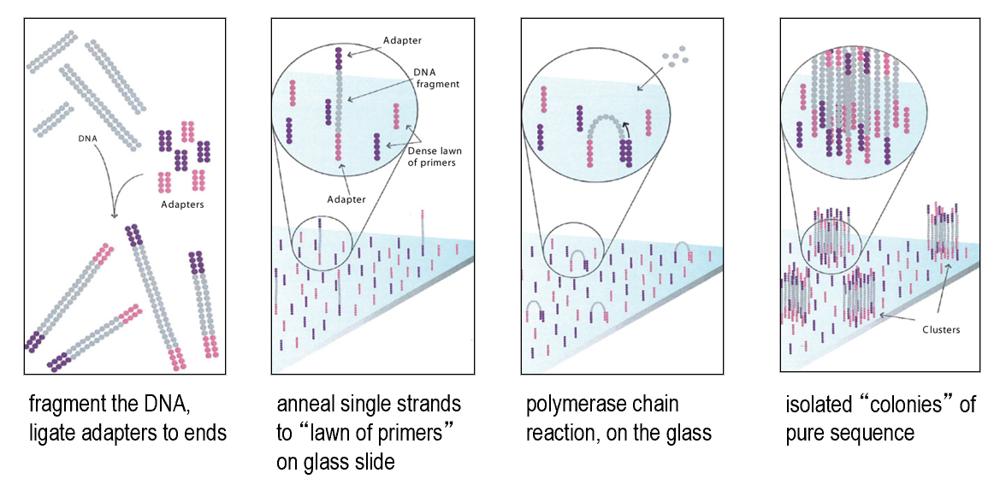

### Barcoding and "linked reads"

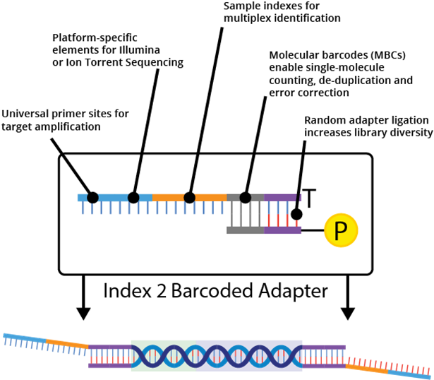

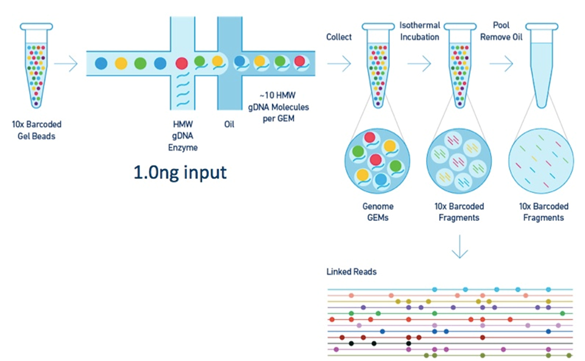

### Sequencing technologies

First-generation sequencing needs DNA size-separation on a gel

Improvement: get rid of gel (sequencing by synthesis)

#### Pyrosequencing

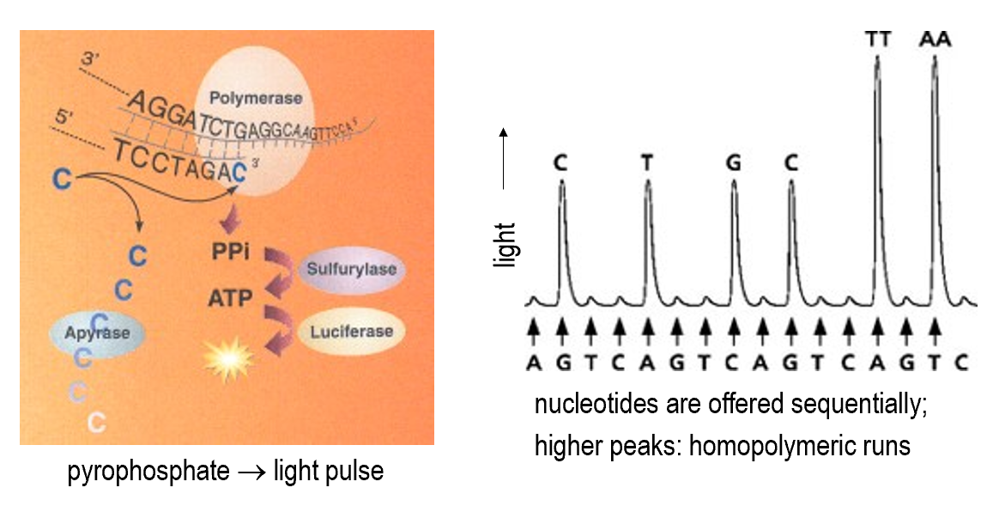

#### Reversible terminator sequencing

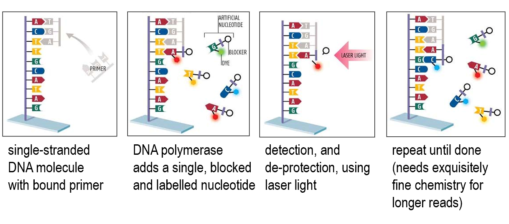

#### Sequencing by semi-conductor

Directly detects the release of H+ ions when a nucleotide is incorporated into the growing DNA strand.

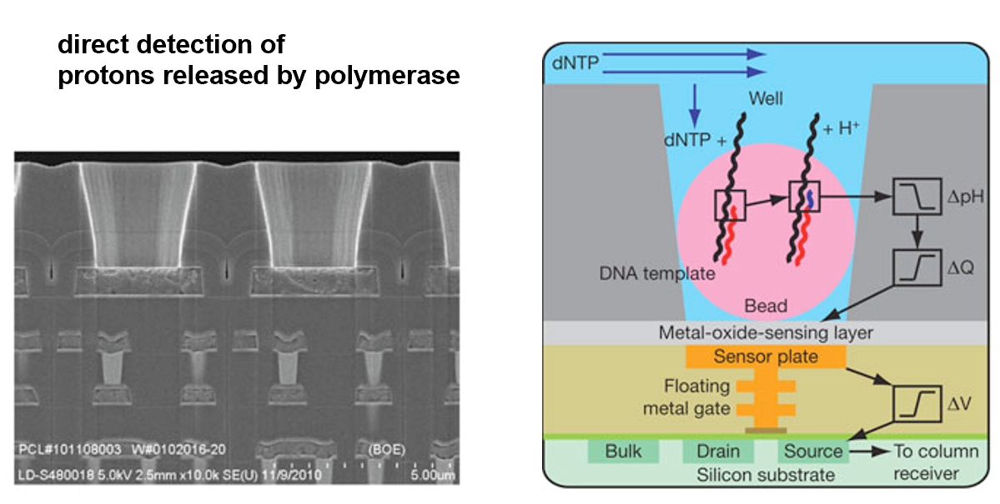

### Current implementations of NGS

- Illumina
  - Illumina NovaSeq 6000
  - PCR on <u>solid support</u>
  - <u>reversible terminator</u> sequencing
  - read length ca. 250bp
  - `1e14` bp per run
- Ion Torrent / Life Techn. Inc
  - Ion Gene Studio S5
  - PCR on <u>beads</u>
  - sequencing by <u>semi-conductor</u>
  - read length ca. 600bp
  - `1e10` bp per run

## Third-generation sequencing technologies

**Single molecule sequencing**. **No** need for **amplification**.

Characterized by extremely long reads, but also high error rates.

- Pacific Biosciences
  - **SMRT** (single molecule real time) sequencing
  - 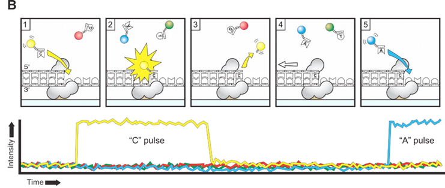
  - 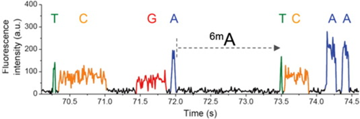
- Oxford **Nanopore**
  - MinION
  - 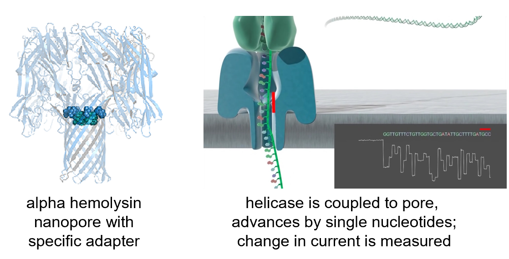

> **Self-note**: minimap2 is a popular aligner for long reads.

## Environmental sequencing

<u>Traditional genome sequencing</u> requires individual **cell isolation** and **cultivation**. This is not possible for the majority of microorganisms. But one advantage is that it's possible to re-assemble the genome from the reads.

Environmental sequencing: directly sequence DNA extracted from the environment without purification and clonal cultivation. Genome assembly is generally not possible.

> **Self-note**: data generated from environmental sequencing is typically large in size, but highly fragmented and contaminated. Lots of exciting research in this area.

### How to deal with environmental sequencing data

- Novel gene discovery
  - Sequence identity comparison to known genes
    - But > 50% of the environmental genomes are not similar to any known genome
- Novel gene families
- Gene family clustering (similar samples have similar gene family distribution)

## Single-cell sequencing

### Why?

- **Heterogeneity** in cell populations
  - Tumor cells
  - Immune cells
  - Microbial communities
  - Developmental biology

### How?

In short, we first get **single** cells, then amplify the **whole genome** and sequence it.

The challenges lie in the bolded parts.

#### Single-cell isolation

(In the very first "single cell" genomics paper, the "single" cells were literally picked manually...nowadays we don't do that)

1. Sorting with optical tweezers
   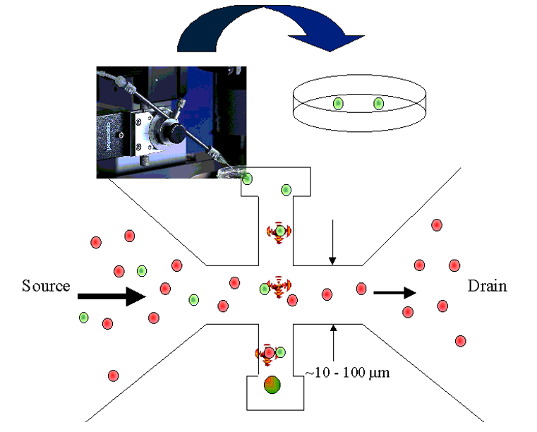
2. Dilution series
3. Flow sorting
   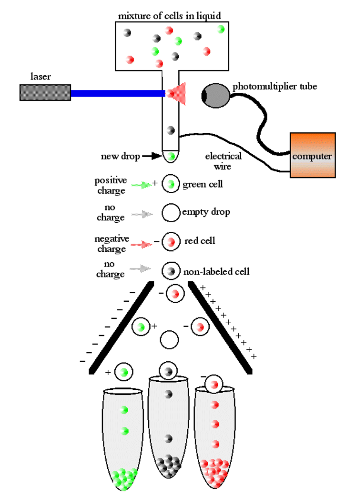

#### Whole genome amplification

Steps summarized:

1. MDA
2. phi 29 debranching
3. S1 nuclease digestion
4. DNA pol I nick translation
5. Cloning

- Isothermal **Multiple displacement amplification** (MDA)
  - **Phi29** DNA polymerase
  - **Random primers**
  - **Isothermal** amplification

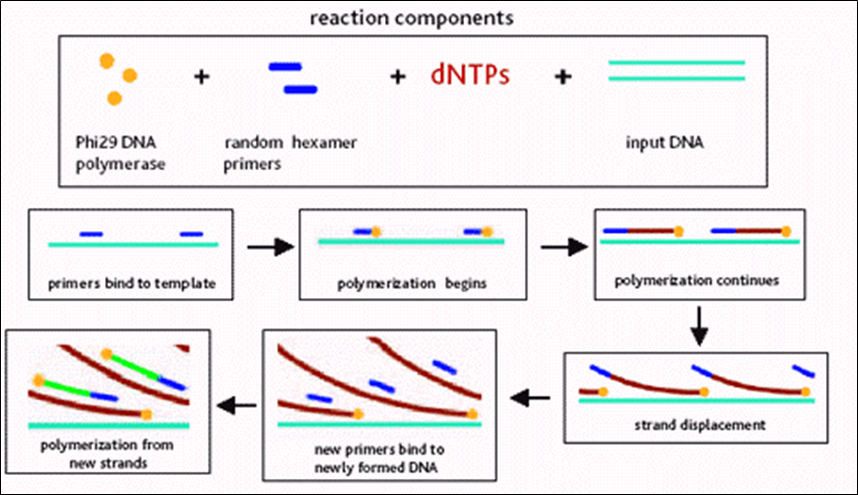

After MDA, we obtained a "**hyperbranched chromosome**". After *debranching* and cloning, we can sequence and re-assemble the genome.

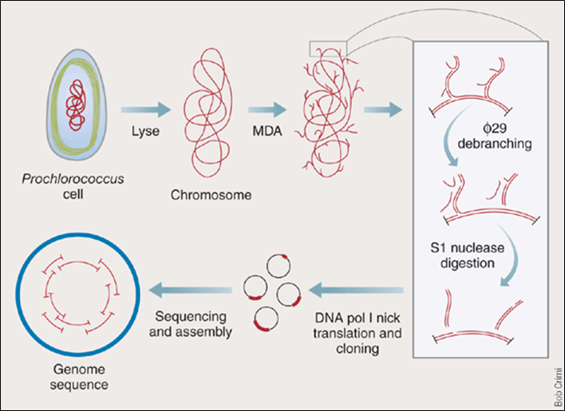

The debranching is done by incubating phi 29 DNA pol with hyperbranched DNA **without any primer**. The *strand-replacement* activity of phi 29 DNA pol will remove the hyperbranched structure.

S1 nucleases are used to remove the remaining single-stranded DNA.

Nicks are filled in by DNA pol I (has 5'->3' exonuclease activity).

## Genomic databases

This section likely won't be covered in the exam.

> **General popular resources**:
>
> - Raw data: NCBI **sequence read archive (SRA)** (also it's European counterpart, EBI **European Nucleotide Archive (ENA)**, but they are basically the same thing now)
>   - seq quality score included
>   - but incomplete: legacy & newer data not available
>   - gigantic in size
> - Sequencing projects: [GOLD (Genomes OnLine Database)](genomesonline.org)
>   - keep track of "who is sequencing what" and responsible researchers (contacts), funding sources, sequencing centers etc
> - Genome browsers
>   - Display features (genes, transcripts...) on the genomes, show annotations (conflicts, variants also included), homolog search
>   - UCSC genome browser, Ensembl (popular in Europe)
>   - Pros and cons of genome browsers
>     - Pros
>       - easy to use
>       - regularly updated
>       - automated annotation pipelines => fast to include new genomes
>       - very powerful export utilities (`BioMart` in Ensembl)
>       - API for local access
>       - DAS (distributed annotation system) for data exchange
>       - long term project, stable funding, likely not going away
>     - Cons
>       - focus on vertebrates, few other genomes
>       - complex db schema
>       - popular, so can be slow
>
> Special ones:
>
> - Comparative genomics databases
>   - STRING (protein-protein interactions, focused on microbial genomes, maintained by von Mering group at UZH)
>   - specialized on comparing genomes (at nucleotide-level, or gene-level)
>   - to visualize evidence of selection (exons, regulatory sites, ...)
>   - to infer past evolution of genomes (rearrangements, gains, losses, ...)
>   - to establish gene histories (orthology, paralogy, synteny, ...)
>   - often require extensive offline computation before they go online
>   - some of their services also offered by generic genome browsers/sites.
> - Organism-specific databases
>   - Flybase, Wormbase, TAIR, SGD...
>   - community driven, extensive manual input
>   - specific terms, abbreviations, gene names...
> - Specialized databases
>   - IGSR: human population genetics
>   - OMIM: known disease-causing mutations
>   - KEGG: metabolic pathways and enzymes
