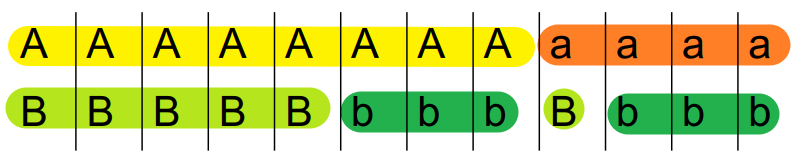
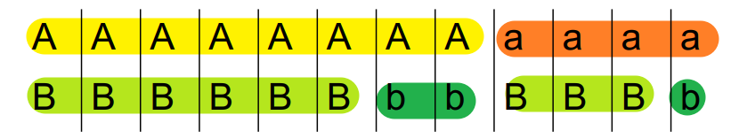
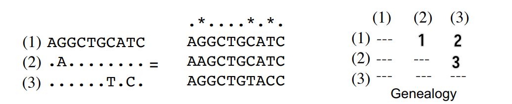

# Modern Genomics II

I cannot understand his accent...

<!-- toc -->

## Contents that (I think) are important

### Linkage disequilibrium (LD)

#### Coefficient of linkage disequilibrium \\( D \\)

Given two loci \\(A\\) and \\(B\\) (can have allele \\(A\\) or \\(a\\), \\(B\\) or \\(b\\)), the coefficient of linkage disequilibrium \\(D\\) is defined as

\\[
D = \frac{P_{AB} - P_A P_B}{P_A P_B}
\\]

Below shows two examples of \\(D\\) calculation.

\\[
D = \frac{P_{AB} - P_{A} P_{B}}{P_{A} P_{B}} = \frac{5}{12} - \frac{8}{12}\times\frac{6}{12} = \frac{1}{12}
\\]

A and B are linked to some extent.

\\[
D = \frac{P_{AB} - P_{A} P_{B}}{P_{A} P_{B}} = \frac{6}{12} - \frac{8}{12}\times\frac{9}{12} = 0
\\]

Here A and B are not linked at all.

Basically we are testing whether P(A) and P(B) are <u>independent</u>.

### Relative measures of LD

1. \\(r^2 = \frac{D}{P_A P_a P_B P_b}\\)
2. \\(D' = \frac{D}{D_{\max}}\\) if \\(D\\) is positive, \\(D' = \frac{D}{D_{\min}}\\) if \\(D\\) is negative

### Nucleotide diversity \\(\pi\\)

Average proportion of pairwise differences between the sequences

Give a multiple sequence alignment, \\(\pi\\) is defined as

\\[
\pi = \sum_{i < j} \frac{\pi_{ij}}{n_c}
\\]

where \\(n_c = \frac{n(n-1)}{2}\\) is the number of pairwise comparisons, and \\(\pi_{ij}\\) is the proportion of differences between the \\(i\\)th and \\(j\\)th sequences.

Below shows an example of \\(\pi\\) calculation.

\\[
\pi = \sum_{i < j} \frac{\pi_{ij}}{n_c} = \frac{\pi_{12} + \pi_{13} + \pi_{23}}{3} = 0.2
\\]

Basically just calculating the average number of differences in the matrix.

## Course contents according to recording

Title: Applications of next-generation sequencing and other genomic techniques

1. Resequencing to identify genetic basis of phenotypic variation
   1. Outlier approach
   2. Genome-wide association studies (**GWAS**) and **linkage disequilibrium**
2. Introduction to RNA-seq (transcriptome) focusing on genome duplication
3. Resequencing to detect signature of selection: **nucleotide diversity**

Microbial community and metagenomics, ChIP-seq, epigenomics, whole genome assembly as reference

- Evolutionary functional genomics can...
  - identify ecologically relevant genes
  - inferring selection & population processes
