# Transcriptomics I

Unimportant text is grayed out but worth reading for fluency and context.

<!-- toc -->

## Motivation

 We are interested in the expression of genes in a
cell. Altough <u>proteins are the actors</u> of genes instead of mRNA
transcripts, <em>mRNAs transcripts are easier to measure</em> because selection
has chosen them to convey the genetic message in a faithful way. Also there are
plenty of interesting <em>non-coding RNAs</em>. 

## RNA species

80% of the total RNA is rRNA. 14% is tRNA. Only 1-3% is mRNA. All other species
account for the remaining 1-3%.

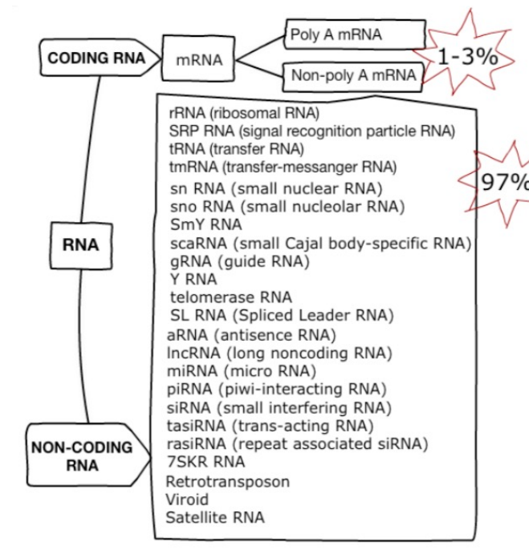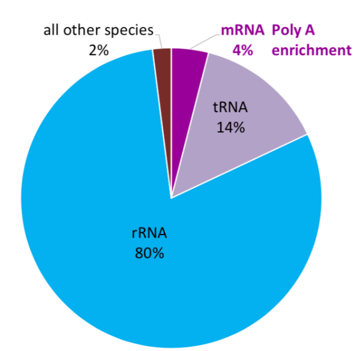

## RNA selection methods

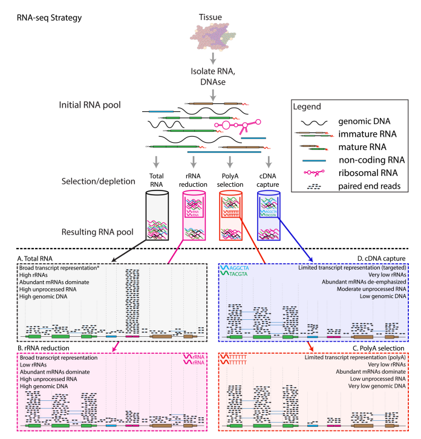

- A: total RNA
  - Unbiased estimation
  - Dominate by rRNA, not very informative
- B: ribosomal reduction/depletion
  - Use probes that bind to rRNA and pull them out
  - < 5% rRNA left
- C: poly-A selection
  - Use probes that bind to poly-A tails
  - Selects for mRNA, and also some long non-coding RNAs (because they also have
    poly-A tails)
- D: cDNA capture
  - Design target probes that bind to a certain set of RNAs
  - Limited transcriptome coverage

 90% of transcriptome research utilize poly-A
selection; 5% of them go for ribosomal depletion because their mRNAs are of low
quality and fragmented. The rest 5% do have high-quality mRNAs but still go for
ribosomal depletion because they want to estimate other RNA species at the same
time.

Note: current illumina sequencers cannot sequence miRNAs (20-25nt) and mRNA
fragments (100-300nt) together (<u>because of the large length discrepency</u>)

## RNA-seq experiment workflow overview

A typical RNA-seq experiment workflow is shown below.

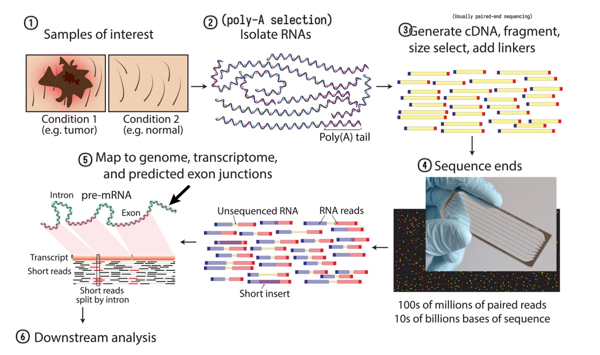

 We can do either single-read sequencing or paired-end
sequencing (as is shown in the figure above) in the third step. 

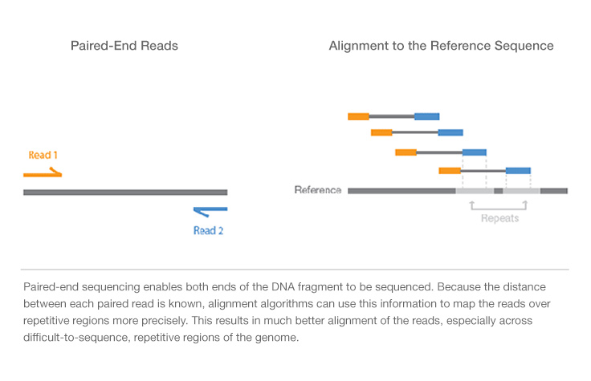

It can also be summarized into a flow diagram.

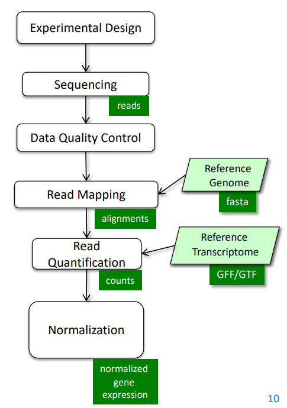

The following sections will go into more details about each step.

## RNA-seq experiment design

- RNA-seq experiments are implemented as **comparative experiments**
- RNA-seq is used to measure the **relative abundance (expression)** of each
  mRNA (gene) in a <u>sample</u>
  - <u>sample</u>: We
    cannot sequence all the RNA fragments. Instead, we randomly select about 20M
    fragments as a representation of the total RNA obtained. Note that we can
    sample multiple times. 
- RNA-seq can link gene expression to
  - genotype
  - phenotype
  - treatment response 

## RNA-seq read mapping methods

### Considerations

 Ideally, the read mapping process is as simple as
<strong>sequencing the transcribed RNAs</strong> and then <strong>mapping the
sequences back to the genome</strong> to identify the gene expression. 

 However, in reality, the process is much more
complicated because <u>current sequencers can only perform faithful sequencing
up to a couple of hundreds of bp (usually 200-800bp)</u>, and a typical mRNA is
2-3kb long. Thus, the mRNA needs to be first chopped into fragments and then
sequenced. When we do the mapping, we're mapping the chopped reads back to the
genome instead of the whole spliced sequences. The existence of <u>alternative
splicing (protein isoforms)</u> and <u>sequencing errors</u> makes the mapping
process even more complicated. 

 While discussing the mapping process, those
limitations and problems should be kept in mind. 

#### How to map reads to a genome?

- Mapping algorithms must be
  - Fast
    - Thus usually find perfect or near-perfect (tolerating 1bp mismatch) match
  - Able to handle SNPs, indels and sequencing errors

We can always perform sequence alignment (here needs local
alignment/**Smith-Waterman alignment**). Of course the score matrix should be
good to determine the correct alignment. But this is slow because it requires
quadratic efforts.

#### What if we want to map billions of reads?

- **Indexing method**
  - Reads are aligned by **index lookup** instead of $O(n^2)$ seq comparison
  - Usually hashed so the lookup time is much faster
  - If lookup fails, actual sequence comparison is performed (more details on
    this in next chapter)
  - Major aligners use the <u>**Burrows-Wheeler transform (BWT)**</u> to index
    the reference genome
    - Very small. Even for the human genome the index
      fits into 3GB RAM. 
- Example aligners
  - [**bowtie**, **bowtie2**](#bowtie)
  - BWA
  - [**TopHat2**](#tophat2)
  - [**STAR**](#star)
  - SOAP
  - ...

#### How to deal with SNPs and indels?

- **SNPs**
  - Can always be handled by performing real
    Smith-Waterman alignment but expensive 
  - At mismatched positions, try all possible bases and search the BWT index
    again
    - Computing effort grows exponentially
  - **Gapped alignment**
    - Chop reads into short segments (seeds)
    - align those seeds in a <u>mismatch-free</u> manner (typically using BWT
    index lookup again)
    - stitch them back together
    - Might require multiple rounds of chopping
- **Indels**
  - Can only be found with **gapped alignment** (described above), BWT lookup is
    not enough

#### How to deal with introns (basically very large insertions)?

- Approaches
  - Map directly to **trapscript sequences** (no intron) not to the genome
    - Pro: introns are not a problem
    - Cons: unknown genes/isoforms cannot be detected
  - **Spliced alignment** to genome
    - Pro: finds reads from unknown gene loci or unknown isoforms
    - Con: larger search space, potentially more false positives, wrong
      alignment to <u>pseudogenes</u>
  - Combination of above
- Difference between spliced alignment and gapped alignment
  - Gapped alignment: longer gaps means high score penalty and lower score
  - Spliced alignment: long gaps at canonical splice-sites <u>are allowed</u>,
    but lacking canonical splice-sites or gaps elsewhere (at non-canonical
    splice sites) are penalized
- Pseudogenes
  - associated *retrotransposed* spliced sequence of a certain gene, thus
    *intron-free*, and appears "*exonic*"
  - Have almost the same sequence as the original gene
  - Not functional because they do not have access to promotors so won't be
    transcribed
  - Usually contain more mutations because there are no selection pressures to
    keep them intact
  - Exonic reads will map to both the gene and its pseudogene, but likely
    preferring gene placement due to lack of mutations
  - A spliced read could be incorrectly assigned to the pseudogene as it appears
    to be exonic, preventing higher scoring spliced alignments from being
    pursued

### Bowtie

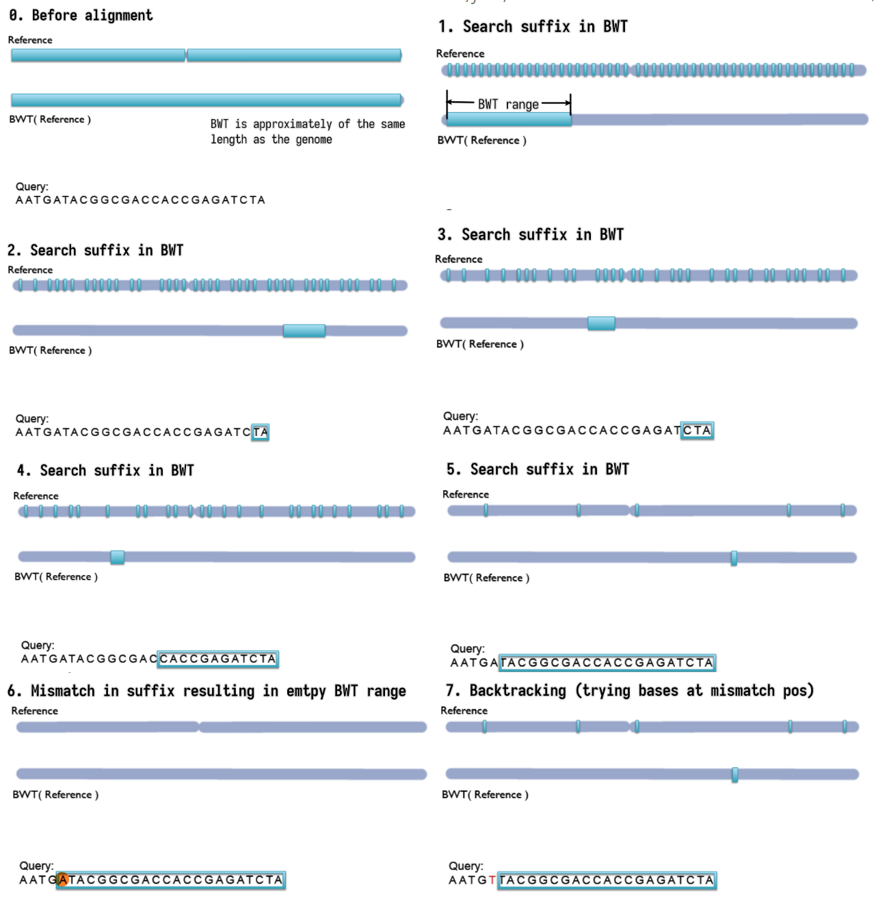

- Step-by-step backward searching the <u>**suffix**</u> of the query sequence in
  the BWT index
  - Exact matching
- Searched suffix appears consecutively in BWT
- The size of range in BWT shrinks or remains the same
- <u>**almost does not handle mismatches**</u>; a single mismatch will lead to
  <u>empty BWT</u> range / failed index lookup
  - mismatches can come from
    - Sequencing error (illumina: $1/1000$)
    - True variation (SNPs, human mutation rate $\approx 1/10^4$
  - mismatches are not rare events! at least 10% of >100nt reads
- Empty BWT range activates **backtracking**
  - All possible bases are tried at the mismatched position
  - Gapped alignment

### TopHat2

**Handles mismatches** by gapped alignment. It <u>first</u> performs (optional)
<u>transcriptome alignment</u> (exonic), and then performs <u>genome
alignment</u> for the unmapped reads. The unmapped reads in the second step are
multi-exon spanning reads and undergo <u>spliced alignment</u> by chopping the
reads into even shorter segments and splice site identification etc.

> The figure is too complicated, not recommended to go into details but still
> attached here for reference. 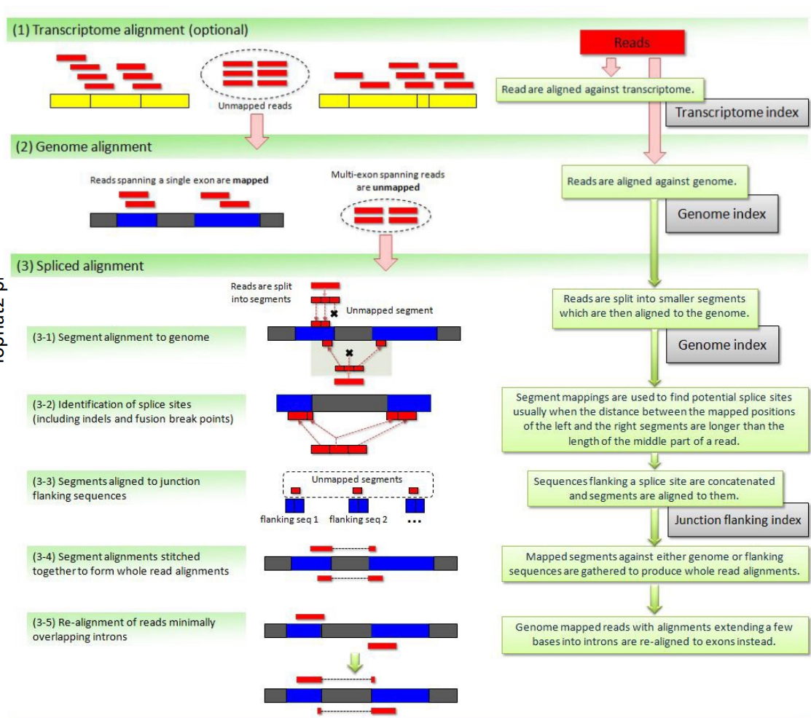

### STAR

**Direct** alignment of non-contiguous sequences to the reference genome.

- First find Maximal Mappable Prefix (MMP) of the read
  - MMP is the longest prefix of the read that can be mapped to the reference
    genome
  - MMP is found by searching the BWT index
  - Possible to tolerate a certain degree of mismatches using extend mode
- Stop extending MMP if MMP covers the whole read or encounters a mismatch
- In the second case, find the MMP of the remaining suffix of the read
- Repeat until the whole read is covered
  - Possible to use trim mode to get rid of A-tail or adapter sequence

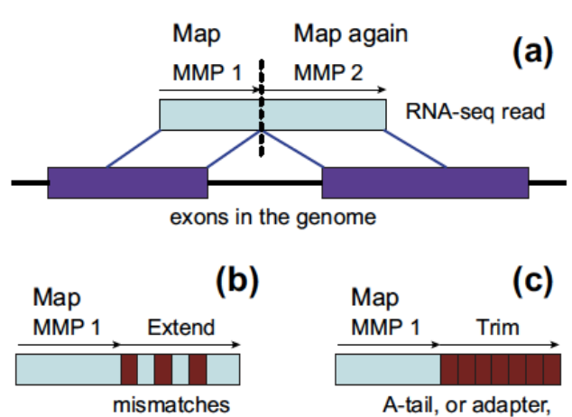

## Quality control and reporting considerations after mapping

### PHREAD quality

- Each called base is given a quality score $Q$
- $Q = -10 \log_{10}(p)$ (PHRED score)
  - $p$ is the estimated probability of the base being called incorrectly
  - $Q$ is the negative log of the probability
    - Q-score = 10: prob = 0.1
    - Q-score = 20: prob = 0.01
    - Q-score = 30: prob = 0.001
  - **Q30** is often used as a cutoff for high quality reads
- How to use: downweight the low-quality bases when computing the alignment
  score
- First introduced for capillary sequencers
- PHRED scores are determined by the sequencer that
  directly rates how reliable the measured signal is

### Read trimming

Not all parts of the read are useful for alignment. It is common to trim the
reads.

- Reasons for trimming:
  - Systemetic errors of sequencer
    - Illumina sequencers have high error rate at the first few bases
    - Basically all sequencers have increasing error rate towards the end of the
      read
  - Adapter trimming
    - If the inserted DNA/RNA fragment is too short, the read will contain part
      of the adapter (since the sequencer generally will sequence 100bp at each
      end)
    - Can be challenging if:
      - The inserted sequence is 90-100bp -- the incorporated adapter sequence
        will only be a few bp long
      - The read has many sequencing errors
  - 3'-bias / degradation
    - The 3' end of the read is generally more likely to be degraded than the 5'
      end
    - Depending on RNA degradation and extration protocols reads may not be
      equally distributed along the transcripts
- Trimming methods
  - **Hard trimming**: trim a fixed number of bases from the beginning and/or
    end
  - **Quality trimming**: cut the end of the read as soon as the base quality
    drops below a threshold
  - **Soft trimming**: trim the read that cannot be aligned to the reference
    genome

### Multiple alignments and report considerations

- A read may have multiple valid alignments with identical or similarly good
  alignment scores
  - Aligners may use different reporting strategies:
    - **Randomly** select one alignment from the top-scoring alignments
    - Report <u>all</u> alignments that are <u>within delta</u> of the
      top-scoring alignment; clip if more than $N_{max}$ alignments are found
    - Report only alignments if they are **unique** (no other alignment within
      delta of the alignment score)
    - Do not report anything if more than $N_{max}$ valid alignments are found
    - …
- Whether a read has a **unique alignment** depends on
  - the read sequence and the sequence homology of the organism
  - the search algorithm of the aligner
- Whether a read has a **single reported alignment** depends *additionally* on
  - the reporting options strategy of the aligner

## Expression quantification

- Expression quantification on
  - **Gene level**
    - Reads belong to a gene locus
  - **Isoform level**
    - Reads belong to an isoform

### How to count reads?

- **Unique mapped reads**
  - Multi-reads are ignored – potentially biased quantification
- **All mapped reads**
  - Assignment of multi-reads need abundance estimation of overlapped
    genes/isoforms

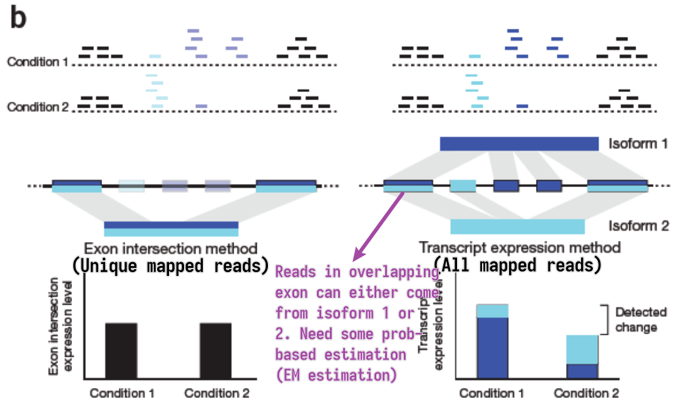

#### EM estimation

- General steps
  1. Estimate abundances based on <u>uniquely mapping reads only</u>
  2. For each multi-read, divide it between the transcripts to which it maps, proportionally to their abundances estimated in the first step
  3. Recompute abundances based on updated counts for each transcript
  r.
  4. Continue with Step 2
- Model the sequencing and analysis process with a likelihood function
- E-step: Compute expected read counts given current expression levels
- M-step: Compute expression values maximizing likelihood given expected read counts

#### Alignment-free RNA-seq quantification

Instead of building BWT, we build hashed k-mer index based on known
transcriptome, and search the k-mers in the reads to map and compute abundance.

Easier to understand through side-by-side comparison with the traditional
alignment dependent method:

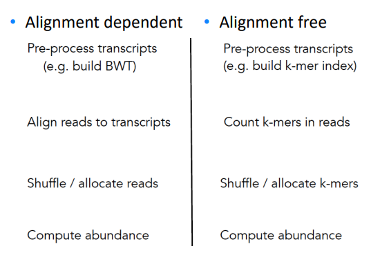

While allocating k-mer to transcript, we try to make each transcript covered
as uniformly as possible.

- Pros
  - Accurate and fast in quantifying **KNOWN TRANSCRIPTS**
  - Counts can be aggregated to get gene-level quantification
- Cons
  - Less well annotated genomes – less accurate results
  - No alignments – no information about SNPs
  - Transcript coverage is not uniform

### Normalization
