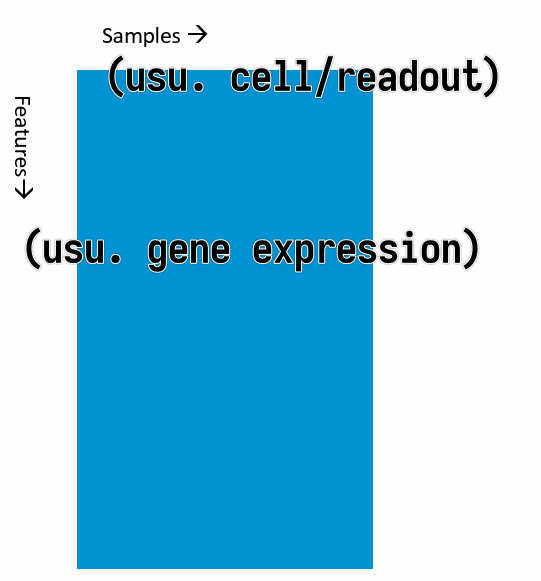

# Transcriptomics II

<!-- toc -->

<!-- ## Why exploratory data analysis?

tbc

## What do we study

- Good comparability: usually compare systems with small perturbations
  - Majority of the genes on the first diagonal
  - Only a few genes up- / downregulated

NEED FIGURE

- Bad comparability
  - TO FINISH

NEED FIGURE

- Meaningless comparison
  - Between different cell types

 -->

## Methods of Exploratory Data Analysis

Typical shape of data we have in hand: a data matrix.

where the **columns** are the **samples** and the **rows** are the **features** (usually gene expressions). (It can be the other way around, but this is the most common case.)

- **Clustering**
  - Hierarchical clustering
  - k-means clustering
- **Dimensionality reduction**
  - Matrix Factorization
    - **PCA**
    - **MDS** (Multidimensional Scaling)
  - Graph-based methods
    - **t-SNE**
    - **UMAP**

## Clustering

- Goals
  - group **similar samples**
    - evaluate similarity between expression profiles of the samples
    - test if similarities match the experimental design and effect sizes
    - test if variations within condition is smaller than between conditions
    - outliers detection
  - group **similar genes**
    - **guilt by association**: infer functions of unknown genes from known genes with the same expression pattern (co-expression)

### Distance measures

To cluster samples, we need to first define a "distance" measure between samples.

Commonly used distance measures:

- **Euclidean distance** (typically for clustering <u>samples</u>)
  - Euclidean distance of two profiles $\mathbf{x}$ and $\mathbf{y}$ with $p$ genes (i.e. the distance between two $p$-dimensional vectors $\mathbf{x}$ and $\mathbf{y}$)
  - $d(\mathbf{x}, \mathbf{y}) = \sqrt{\sum_{i=1}^{p} \left(x_i - y_i\right)^2}$
  - **Expression values MUST BE LOG SCALE**
- **$1 - \text{corr}(\mathbf{x}, \mathbf{y})$** (typically for clustering <u>genes</u>)
  - Correlation coefficient of two profiles $\mathbf{x}$ and $\mathbf{y}$ with $p$ samples
  - $\text{corr}(\mathbf{x}, \mathbf{y}) = \frac{\sum_{i=1}^{p}(x_i - \bar{x})(y_i - \bar{y})}{\sqrt{\sum_{i=1}^{p}(x_i - \bar{x})^2 \cdot \sum_{i-1}^{p}(y_i - \bar{y})^2}}$
  - $\bar{x} = \frac{1}{p}\sum_{i=1}^{p}x_i$
  - $\bar{y} = \frac{1}{p}\sum_{i=1}^{p}y_i$

### Hierarchical Clustering

**Algorithm**:

1. Compute the distance matrix ($n \times (n - 1) / 2 \rightarrow O(n^2)$) between all samples
2. Find pair with minimal distance and merge them
3. Update the distance matrix
4. Repeat 2-3 until all samples are merged

**Parameters**:

- distance measure for samples
  - usually $1 - \text{corr}(\mathbf{x}, \mathbf{y})$ for gene expression
- distance measure for clusters (**linkage rule**)
  - **Single** linkage: **minimum** distance between any elements of the two clusters
  - **Complete** linkage: **maximum** distance between any elements of the two clusters
  - **Average** linkage: **average** distance between *all* elements of the two clusters
  - **Ward's** linkage: **minimal** increase in **intra-cluster variance**

**Input**:

- **distance matrix**
  - The linkage can be derived directly from the distance matrix.
  - Hence clustering algorithm only needs the distrance matrix as input, not the measurements individually.

### k-means Clustering

**Algorithm**:

1. Randomly assign each sample to one of the $k$ clusters
2. Compute the centroid (cluster center, average of the assigned samples) of each cluster
3. Assign each sample to the cluster with the closest centroid
4. Repeat 2-3 until convergence or a maximum number of iterations

**Parameters**:

- number of clusters $k$
- distance measure for samples

**Input**:

- data matrix (cannot directly use distance matrix)

This method **minimizes the intra-cluster variance**.

Choice of $k$ affects the result.

### Comparison of Hierarchical Clustering and k-means Clustering

| | Hierarchical Clustering | k-means Clustering |
| --- | --- | --- |
| Computing time | $O(n^2 \log (n))$ | $O(n \cdot k \cdot t)$ <ul><li>$t$: number of iterations</li><li>$k$: number of clusters</li></ul> |
| Memory | $O(n^2)$ | $O(n \cdot k)$ |

When clustering large numbers of genes (>`1e4`, hierarchical clustering is not practical

## Dimensionality Reduction

### Principal Component Analysis (PCA)

**Goal**: Find a new coordinate system such that the first axis (principal component) captures the most variance, the second axis captures the second most variance, and so on.

The data is **linearly** transformed to a new coordinate system.

### t-SNE

**Algorithm**:

1. In the high-dimensional space, create a *probability distribution* that dictates how likely two points are to be neighbors.
2. Recreate a low dimensional space that follows the same probability distribution as best as possible.

How to find the best low-dimensional representation:

- **preserve the pairwise distances** between neighboring points in the high-dimensional space
- non-linear, different transformations on <u>different regions</u>

Characteristic:

- Powerful, but need to fiddle with random seed and perplexity
- Non-deterministic

### UMAP

Uniform Manifold Approximation and Projection

Approach: Find for each point the neighbors and build simplices (simplex: a generalization of the concept of a triangle or tetrahedron to arbitrary dimensions) and then optimize the low-dimensional representation to preserve the simplices.

## Differential Expression Analysis
