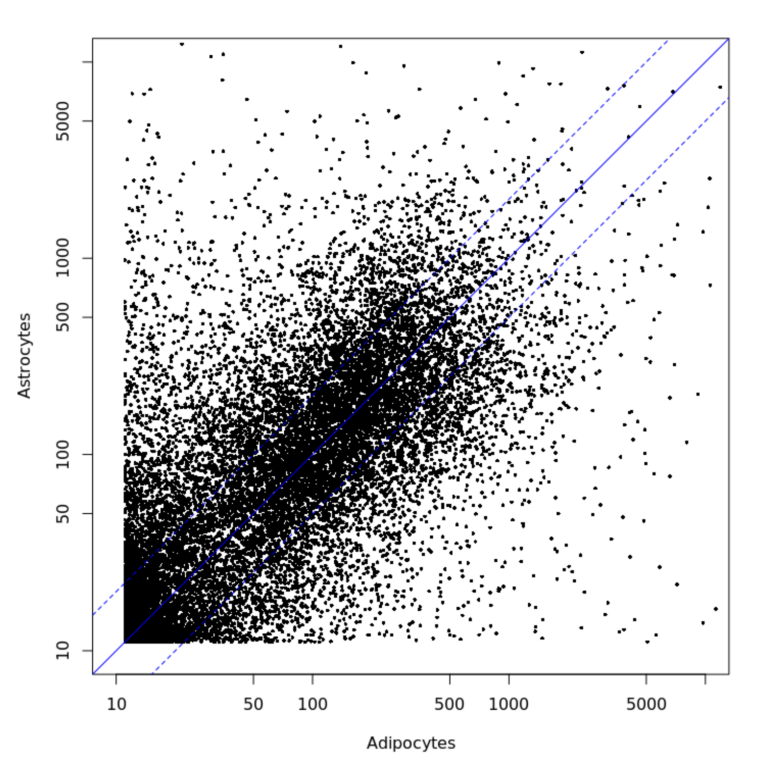

# Transcriptomics II

<!-- toc -->

## Why exploratory data analysis?

tbc

## What do we study

* Good comparability: usually compare systems with small perturbations
  * Majority of the genes on the first diagonal
  * Only a few genes up- / downregulated

NEED FIGURE

* Bad comparability
  * TO FINISH

NEED FIGURE

* Meaningless comparison
  * Between different cell types

## Methods of Exploratory Data Analysis
